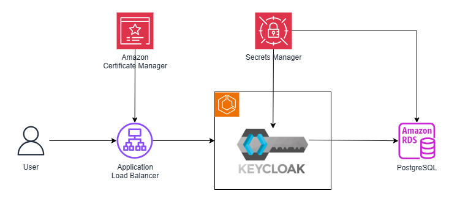

# Deploy KeyCloak on ECS
In this example, we deploy [KeyCloak](https://www.keycloak.org/) on AWS ECS in production mode.  We then expose the application using AWS Application Load Balancer. 

This application is developed using AWS CDK in TypeScript.

## Architecture

## What does it build?
* Creates an ECS Cluster and deployes KeyCloak container
* Creates a RDS PostgreSQL database for hosting KeyCloak internal data
* Uses Secrets Manager to host UI admin user credentials and database credentials* 
* Creates an Application Load balancer (with SSL Certificate in ACM) to expose the service

## Steps to run and test
* Procure and add the appropriate certificate to AWS ACM, so that we can configure TLS.
* Store Certificate metadata to Secrets Manager so that we can use that for configuring the Application Load Balancer.* 
* Deploy the CDK code. Wait for the deployment to finish.  It will print out the API endpoint for you to use.  Use the credentials in Secrets manager to login.
* KeyCloak login page
  * 
* KeyCloak Home Page
  * 
* Follow rest of the setup process.  For additional guidance, follow [KeyCloak Server Administration Guide](smislam/keycloak-on-aws)

## Considerations
* We are using Self-signed Certificate.  Please use a Certificate Provider like Amazon Certificate Manager.
* Enable Secrets Rotations
* Use multi-az database clusters
* You can attempt to create optimized KeyCloak image for faster load.
* There are many more opportunities to enhance this solution

## References
* [KeyCloak](https://www.keycloak.org/)
* [Amazon Elastic Container Service](https://aws.amazon.com/ecs/)
* [Amazon Elastic Load Balancer](https://aws.amazon.com/elasticloadbalancing/)
* [Amazon Certificate Manager](https://aws.amazon.com/certificate-manager/)
